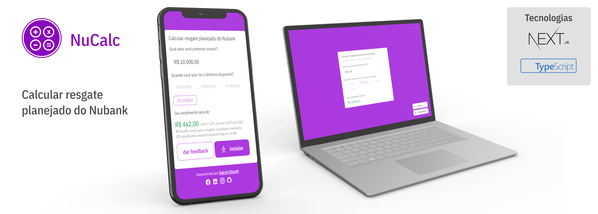

# NuCalc

Esse projeto busca facilitar o cálculo da rentabilidade no NuBank com o resgate planejado.

## Começando

### Pré-requisitos

Para executar o projeto, será necessário instalar os seguintes programas:

- NVM versão 0.35 ou superior para [Linux e MacOS](https://github.com/nvm-sh/nvm#Installing-and-Updating) ou [NVM for Windows](https://github.com/coreybutler/nvm-windows) versão 1.1.7 ou superior

- [Yarn](https://yarnpkg.com/getting-started/install) versão 1.22.0 ou superior

> Recomendado para Linux, MacOS e Windows

### Como rodar

1. Configure a versão do node para v14.15.1 ou superior, recomendados sempre a versão [LTS](https://nodejs.org/en/)

   1.1 Pra isso rode o comando `nvm use a_versao_escolhida`. Por exemplo `nvm use 14.15.1`

   1.2 Confirme a versão do node em execução nesse terminal com `node -v`

2. Instale as dependências executando o comando `yarn` na raiz do projeto.

3. Para rodar o projeto, execute o comando `yarn dev`.

4. Acessar `http://localhost:3000`

## Contribuindo

Se você pretende contribuir com **documentação, correções de bugs ou problemas de segurança**, faça um fork do projeto, adicione seu código e em seguida faça um pull request para esse projeto.

Se você pensou em uma **nova funcionalidade** e deseja contribuir para o projeto, você pode enviar sua proposta pelo [linkedin](https://www.linkedin.com/in/gabrieldissotti/) ou pelo email [gabrieldnrodrigues@gmail.com](mailto:gabrieldnrodrigues@gmail.com) para que possamos fazer uma moderação, mas para ser aprovado basta sua proposta responder as seguintes perguntas:

- Qual problema do usuário você vai resolver?
- Que valor você vai entregar para o projeto e/ou para o usuário?
- Faça um breve resumo da funcionalidade, se possível incluir um rabisco ou protótipo ilustrando sua ideia, podendo ser imagens ou vídeo.
